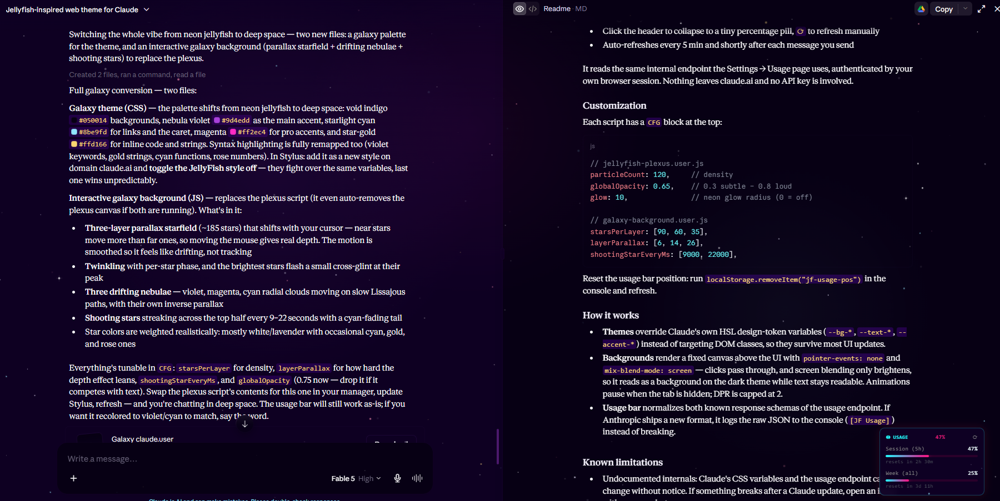

# 🪼 JellyFish Theme for Claude

Claude web ([claude.ai](https://claude.ai)) reskinned with the [JellyFish VS Code theme](https://github.com/PawelBorkar/jellyfish) palette by Pawel Borkar / deep space navy, neon cyan, and hot pink. Plus optional interactive extras: an animated plexus background, a draggable real-time usage bar, and a full **Galaxy** variant.

<!-- Add a screenshot: docs/preview.png -->
<!--  -->

## What's inside

| File | Type | What it does |
|------|------|--------------|
| `jellyfish-claude.theme.css` | Userstyle (Stylus) | The main theme recolors the entire Claude UI via CSS variable overrides, including full JellyFish syntax highlighting for code blocks |
| `jellyfish-plexus.user.js` | Userscript | Interactive plexus particle network cyan/pink glowing nodes that connect to each other and follow your cursor |
| `jellyfish-usage-bar.user.js` | Userscript | Draggable, real-time session + weekly usage meter so you never have to open Settings → Usage. Color-shifts at 70% / 90% |
| `galaxy-claude.user.css` | Userstyle (Stylus) | **Galaxy variant** void indigo, nebula violet, magenta, starlight cyan |
| `galaxy-background.user.js` | Userscript | **Galaxy background** 3-layer parallax starfield with twinkle, drifting nebulae, and shooting stars |

Everything is standalone - install only what you want. The theme works without the scripts, the scripts work without the theme.



## Requirements

- **[Stylus](https://chromewebstore.google.com/detail/stylus/clngdbkpkpeebahjckkjfobafhncgmne)** for the `.css` themes
- **[Violentmonkey](https://violentmonkey.github.io/)** (recommended) or Tampermonkey for the `.user.js` scripts
- Claude in **dark mode**

> ⚠️ **Opera users:** Tampermonkey's userscript injection is often blocked even with Developer Mode on. Use **Violentmonkey** instead it works out of the box.

## Install

### 1. Theme (pick one)

1. Install Stylus
2. Stylus icon → **Write style for: claude.ai** (or Manage → Write new style)
3. Paste the contents of `jellyfish-claude.theme.css` **or** `galaxy-claude.user.css`
4. Set *Applies to* → **domain** → `claude.ai`, save

Don't enable both at once they override the same variables.

### 2. Background animation (optional)

1. Install Violentmonkey
2. Dashboard → **＋ New script** → paste `jellyfish-plexus.user.js` **or** `galaxy-background.user.js` → save
3. Refresh claude.ai

The galaxy script automatically removes the plexus canvas if both are installed.

### 3. Usage bar (optional)

Same as above, with `jellyfish-usage-bar.user.js`. A ◉ USAGE widget appears bottom-left:

- Session (5h) and weekly bars with reset countdown
- **Drag it anywhere** position is remembered
- Click the header to collapse to a tiny percentage pill, `⟳` to refresh manually
- Auto-refreshes every 5 min and shortly after each message you send

It reads the same internal endpoint the Settings → Usage page uses, authenticated by your own browser session. Nothing leaves claude.ai and no API key is involved.

## Customization

Each script has a `CFG` block at the top:

```js
// jellyfish-plexus.user.js
particleCount: 120,     // density
globalOpacity: 0.65,    // 0.3 subtle – 0.8 loud
glow: 10,               // neon glow radius (0 = off)

// galaxy-background.user.js
starsPerLayer: [90, 60, 35],
layerParallax: [6, 14, 26],
shootingStarEveryMs: [9000, 22000],
```

Reset the usage bar position: run `localStorage.removeItem("jf-usage-pos")` in the console and refresh.

## How it works

- **Themes** override Claude's own HSL design-token variables (`--bg-*`, `--text-*`, `--accent-*`) instead of targeting DOM classes, so they survive most UI updates.
- **Backgrounds** render a fixed canvas above the UI with `pointer-events: none` and `mix-blend-mode: screen` — clicks pass through, and screen blending only brightens, so it reads as a background on the dark theme while text stays readable. Animations pause when the tab is hidden; DPR is capped at 2.
- **Usage bar** normalizes both known response schemas of the usage endpoint. If Anthropic ships a new format, it logs the raw JSON to the console (`[JF Usage]`) instead of breaking.

## Known limitations

- Undocumented internals: Claude's CSS variables and the usage endpoint can change without notice. If something breaks after a Claude update, open an issue with a screenshot.
- The overlay backgrounds are faintly visible over modals and images by design (screen blend). Lower `globalOpacity` if it bothers you.
- Usage data availability may differ on free plans.

## Credits

- Palette: [JellyFish](https://github.com/PawelBorkar/jellyfish) by **Pawel Borkar** (Apache-2.0)
- Theme, scripts & galaxy variant: **[Amsy](https://alanms7.artstation.com)** ([@amsy3d](https://gumroad.com/amsy3d))
- Built with Claude 🤝

## License

Apache-2.0 — same as the original JellyFish palette. See [LICENSE](LICENSE).

---

*Not affiliated with Anthropic. Personal cosmetic modifications for your own browser.*
